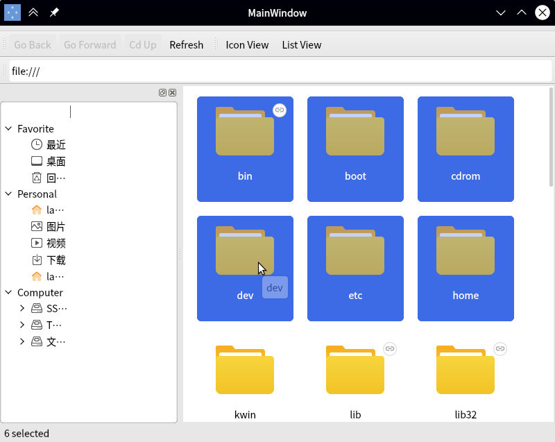

# make_a_file_manager_app_with_libpeony
基于libpeony构建自己的文件管理器

# build and test (on UbuntuKylin 20.04)

> git clone https://github.com/Yue-Lan/make_a_file_manager_app_with_libpeony.git

> sudo apt install libpeony-dev

> mkdir build && cd build

> qmake ..

> sudo make install

# screenshot

## window

